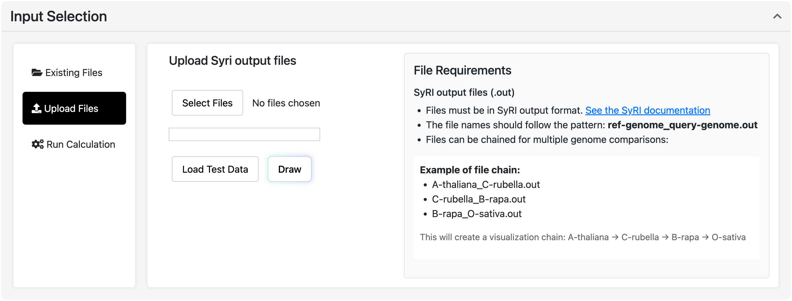

## Description

SynFlow is a powerful web application for visualizing genome alignments and structural variations using SyRI (Structural Rearrangement Identifier) data. It provides an interactive platform for exploring genomic synteny, inversions, translocations, duplications, and other structural rearrangements between genomes.

## Features

- Upload your own data or explore the database
- Interactive zoom and pan
- Filter bands by type and length
- Stack chromosomes vertically or align them horizontally
- Download the visualization as an SVG file

## Usage

#### SyRI output files (.out)
- Files must be in SyRI output format. [See the SyRI documentation](https://schneebergerlab.github.io/syri/fileformat.html)
- The file names should follow the pattern: **ref-genome_query-genome.out**
- Files can be chained for multiple genome comparisons:

Example of file chain:
- A-thaliana_C-rubella.out
- C-rubella_B-rapa.out
- B-rapa_O-sativa.out
This will create a visualization chain: **A-thaliana → C-rubella → B-rapa → O-sativa**

#### Three ways to input data:

  - **Existing files**: select from precomputed datasets. The available files come from analyses performed on several organisms using the SynMake workflow. [See the Synmake documentation.](https://gitlab.cirad.fr/agap/cluster/snakemake/synmake)
  - **Classic upload**: use the "Browse" button to upload your own files
  - **Run the pipeline**: launch the Synmake workflow via the integrated toolkit

#### Click the "Draw" button to generate the visualization.
Use the zoom and pan features to explore the visualization. 
Chromosome order can be changed by drag and drop.

#### Filter the bands using the legend and the slider.
Download graph as SVG

## License

This project is licensed under the terms of the GNU General Public License v3.0. See the [LICENSE](./LICENSE) file for details.

## Authors

- **Marilyne Summo**
- **Gaëtan Droc**
- **Gautier Sarah**
- [Southgreen Platform](https://github.com/SouthGreenPlatform)

See also the list of [contributors](https://github.com/SouthGreenPlatform/SynFlow/contributors) who participated in this project.

## Acknowledgements

- Special thanks to the contributors of the [SyRI tool](https://github.com/schneebergerlab/syri).
- Inspiration from [plotsr](https://github.com/schneebergerlab/plotsr).