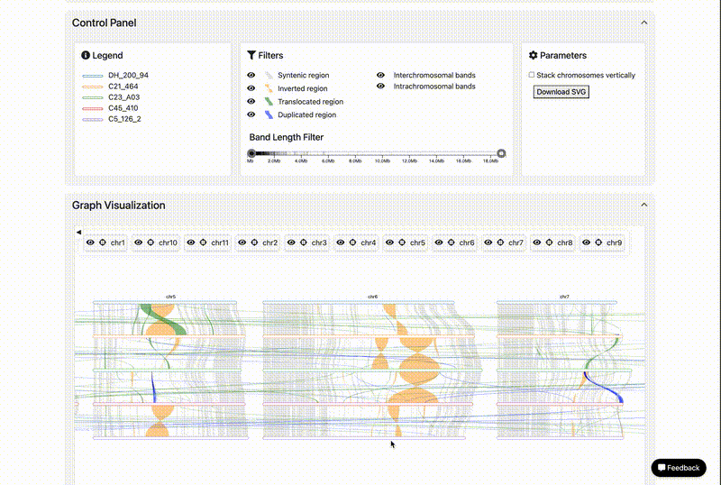

# SynFlow: Structural Variation Visualization Tool

**Synflow** is an interactive web platform designed to visualize structural variations between genomes, using outputs generated by tools like **SyRI**. 

## Input Selection Panel

You can explore genomic comparisons in three ways:

- [1. Use an existing dataset](#1-use-an-existing-dataset)
- [2. Upload your own SyRI results](#2-upload-your-own-syri-output)
- [3. Run the Synmake workflow with your FASTA genomes](#3-run-the-synmake-workflow)

---

### 1. Use an Existing Dataset

To explore without uploading anything, you can choose from a list of curated genome comparisons available for:

- **Banana** (*Musa* species)
- **Grapevine** (*Vitis* species)

1. Go to the **“Existing Files”** tab.

2. Select your dataset from the dropdown (e.g. *m acuminata banksii - m acuminata malaccensis*).

3. Click **Draw** to visualize the structural variants.

---

### 2. Upload Your Own SyRI Output

Files must be in SyRI output results in TSV formats. [See the SyRI documentation](https://schneebergerlab.github.io/syri/fileformat.html)

1. Go to the **“Upload Files”** tab.

2. Upload both files.
3. Click **Draw**.
4. Wait for the visualization interface to load automatically.
 
---

### 3. Run Calculation

Don’t have SyRI results yet? You can submit two genome assemblies (FASTA files), and the **Synmake** pipeline will compute alignments and run SyRI for you.

### What is Synmake?

[Synmake](https://gitlab.cirad.fr/agap/cluster/snakemake/synmake) is a Snakemake-based workflow developed to generate SyRI-compatible results for use in Synflow.

### Required Files:

- Two genome assemblies in `.fasta` format
- Chromosome IDs should match across both genomes for best results

1. Go to the **“Run Workflow”** tab.

2. Upload two `.fasta` genome files (reference and query).
3. Click **Submit**. 

## Graph Vizualisation

The visualization interface supports:

- Interactive zoom and pan functionality  
- Chromosome reordering support  
- Toggle visibility of individual chromosomes (Show/Hide)
  

The GIF depicts a visual example from Figure 3 of the study by Martin et al.

> Martin, G., Istace, B., Baurens, F.C. *et al.* (2025). *Unravelling genomic drivers of speciation in Musa through genome assemblies of wild banana ancestors.* **Nature Communications**, 16, 961. [https://doi.org/10.1038/s41467-025-56329-4](https://doi.org/10.1038/s41467-025-56329-4)

## Control Panel

The control panel allows you to:

- Filter structural variation bands based on their type and size  
- Choose how chromosomes are arranged: stacked vertically or aligned horizontally  
- Download the current visualization in SVG format for high-quality export

