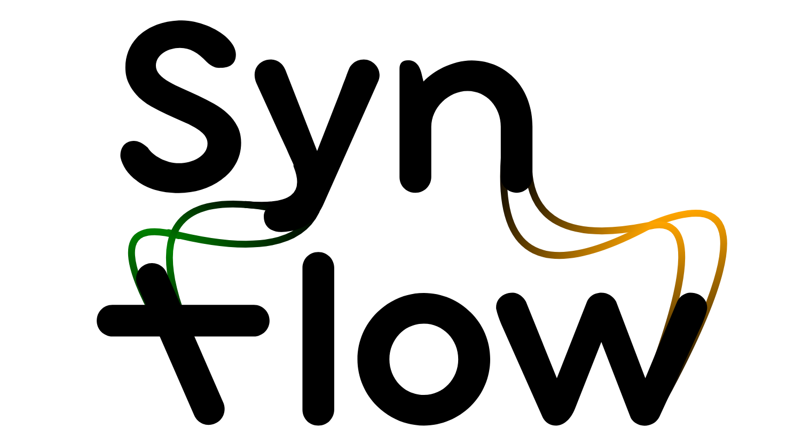

### Description

**Synflow** is an interactive web platform designed to visualize structural variations between genomes, using outputs generated by tools like **SyRI**. 

### Features

- Upload your own data or explore the database
- Interactive zoom and pan
- Filter bands by type and length
- Stack chromosomes vertically or align them horizontally
- Download the visualization as an SVG file

### License

This project is licensed under the terms of the GNU General Public License v3.0. See the [LICENSE](./LICENSE) file for details.

### Authors

- Marilyne Summo
- Gaëtan Droc
- Gautier Sarah

See also the list of [contributors](https://github.com/SouthGreenPlatform/SynFlow/contributors) who participated in this project.

### Citation

>Goel, M., Sun, H., Jiao, W. et al. SyRI: finding genomic rearrangements and local sequence differences from whole-genome assemblies. Genome Biol 20, 277 (2019) [doi:10.1186/s13059-019-1911-0](https://genomebiology.biomedcentral.com/articles/10.1186/s13059-019-1911-0)

### Acknowledgements

- Special thanks to the contributors of the [SyRI tool](https://github.com/schneebergerlab/syri).
- Inspiration from [plotsr](https://github.com/schneebergerlab/plotsr).