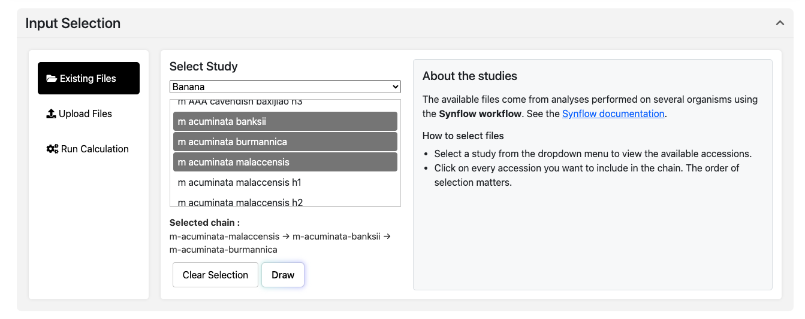
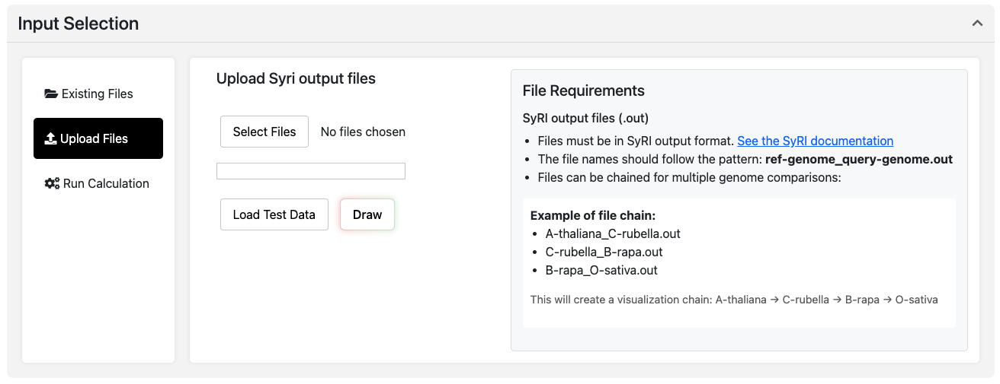
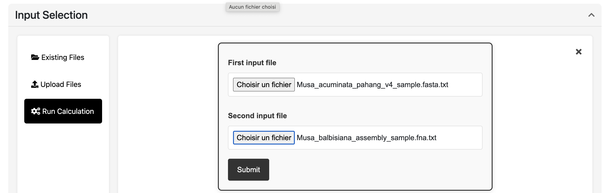

# Input
You can explore genomic comparisons in three ways:

- [Use an existing dataset](#use-an-existing-dataset)
- [Upload your own SyRI results](#upload-your-own-syri-output)
- [Run the Synmake workflow with your FASTA genomes](#run-the-synmake-workflow)

## Use an Existing Dataset

To explore without uploading anything, you can choose from a list of curated genome comparisons available for:

- **Banana** (*Musa* species)
- **Grapevine** (*Vitis* species)

Go to the **“Existing Files”** tab.

Select your dataset from the dropdown (e.g. *m acuminata banksii - m acuminata malaccensis*).

Click **Draw** to visualize the structural variants.

---

## Upload Your Own SyRI Output

Files must be in SyRI output results in TSV formats. [See the SyRI documentation](https://schneebergerlab.github.io/syri/fileformat.html)

Go to the **“Upload Files”** tab.

---

## Run Calculation

Don’t have SyRI results yet? You can submit two genome assemblies (FASTA files), and the **Synmake** pipeline will compute alignments and run SyRI for you.

[Synmake](https://gitlab.cirad.fr/agap/cluster/snakemake/synmake) is a Snakemake-based workflow developed to generate SyRI-compatible results for use in Synflow.

**Required Files:**

- Two genome assemblies in `.fasta` format
- Chromosome IDs should match across both genomes for best results

Go to the **“Run Workflow”** tab.

Upload two `.fasta` genome files (reference and query).

Click **Submit**. 

 